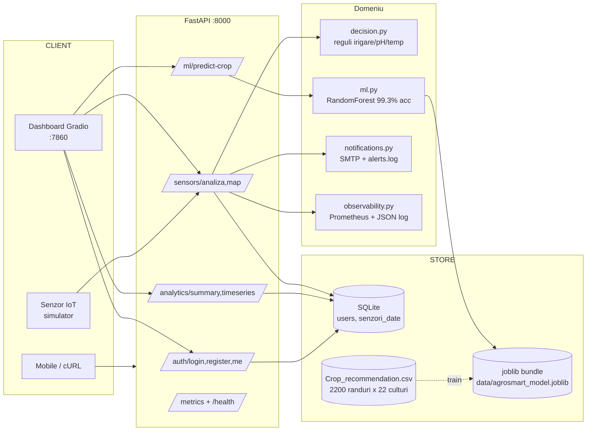
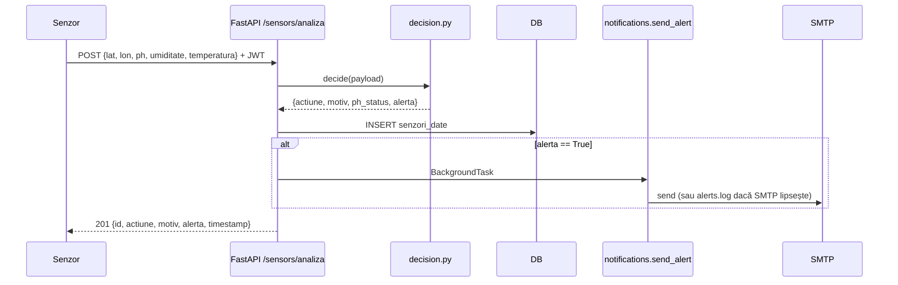

# Arhitectură — AgroSmart AI

> **TL;DR:** API FastAPI + dashboard Gradio + ML RandomForest, totul rulând pe Python 3.10+ cu SQLite local (sau Postgres în prod). Stateless, container-ready, observability prin Prometheus + JSON logs.

## 1. Diagramă de ansamblu

## 2. Fluxul "citire senzor → decizie → alertă"

## 3. Componente

| Modul | Rol | Test |
|---|---|---|
| `app/main.py` | FastAPI app, middleware, lifespan, /metrics | smoke prin `test_*.py` |
| `app/config.py` | Settings via pydantic-settings, env-driven | — |
| `app/database.py` | SQLModel session + init_db | conftest in-memory |
| `app/security.py` | bcrypt + JWT (HS256) | `test_auth.py` |
| `app/decision.py` | Reguli agro deterministe | `test_decision.py` (10 cazuri) |
| `app/ml.py` | Lazy load + predict_crop | `test_ml.py` (5 teste, mock) |
| `app/notifications.py` | SMTP + fallback log | — (integration-only) |
| `app/observability.py` | Prometheus counters + JSON logging | — |
| `app/routers/*.py` | Auth, sensors, analytics, ml | toate testate |
| `dashboard/app.py` | Gradio UI cu tab-uri | manual |
| `scripts/train_model.py` | Antrenare RandomForest 300 trees | smoke prin CI |

## 4. Decizii de design

- **SQLite default + DATABASE_URL override** — zero setup local, 1-line switch la Postgres.
- **JWT stateless** — fără sesiuni server-side; tokenul are doar `sub` + `exp`.
- **Lazy ML loading prin `lru_cache`** — primul request încarcă, restul sunt instant.
- **Background tasks pentru SMTP** — răspunsul API nu așteaptă rețeaua.
- **Folium server-side render** — hartă HTML embeddable în iframe, fără dependență JS.
- **Rate limit `slowapi`** — 60/min default, configurabil prin `RATE_LIMIT_DEFAULT`.

## 5. Hărți pentru extensii

- **Multi-tenancy**: adaugă `org_id` în `User` + index parțial pe `senzori_date`.
- **Predicții serie-temporală**: înlocuiește RF cu Prophet/LSTM, expune `/ml/predict-yield`.
- **Edge inference**: portează `app/ml.py` într-un container ARM (Raspberry Pi).
